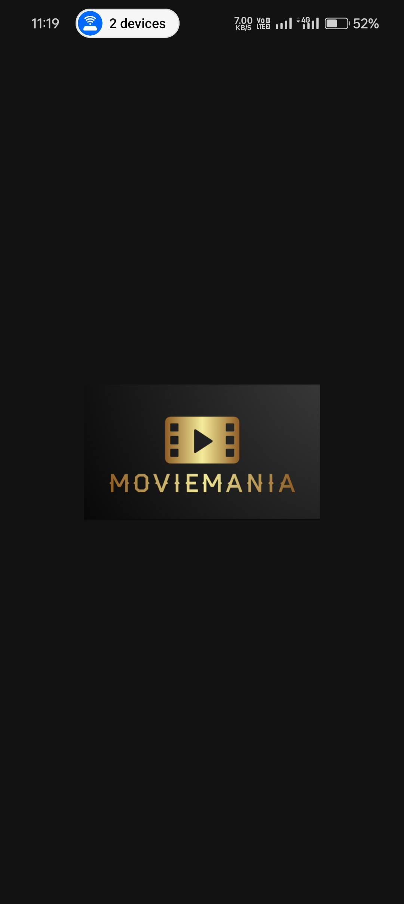
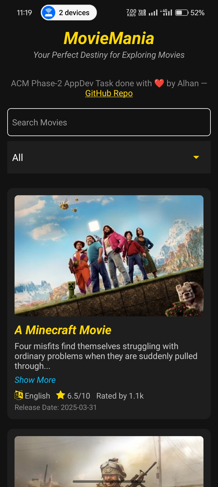
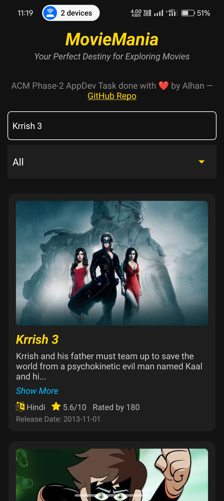
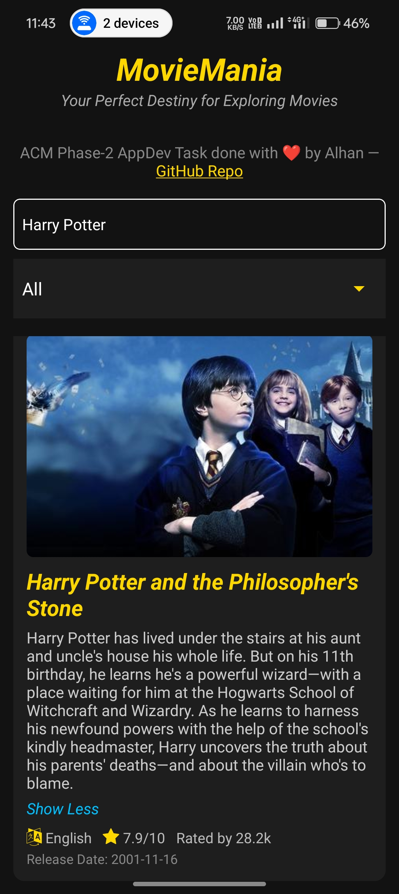
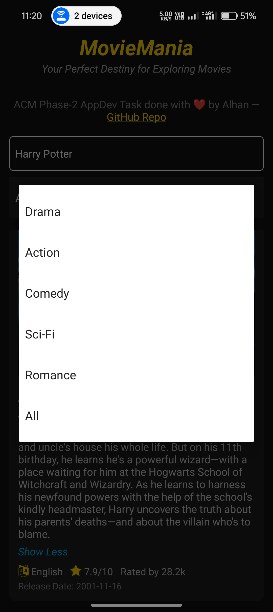

# 🎬 MovieMania — Your Perfect Destiny for Exploring Movies

Welcome to **MovieMania**, a sleek and intuitive mobile application crafted using **React Native** and powered by **TMDB’s Movie API**. This app was developed as part of the **ACM-VIT Phase 2 AppDev recruitment task** with an emphasis on clean UI, real-world API integration, genre filtering, infinite scroll, and performance optimization.

If you're a movie buff looking to explore titles across genres with smooth UX on mobile — you're in the right place.

---

## 📱 About the App

MovieMania is designed to make movie discovery effortless and delightful. Users can:

* 🔍 Search movies by title
* 🎭 Filter by genre (Action, Comedy, Romance, etc.)
* 📅 View movie details: release date, language, rating
* ⬇️ Load more movies as they scroll (infinite scroll)
* 💬 Expand/collapse long movie overviews
* 🔁 Pull to refresh the list
* 🌐 Direct GitHub Repo link to explore source code

All of this is wrapped in a modern **dark-themed** UI optimized for mobile viewing with minimal distractions and maximum usability.

---

## 🔧 Tech Stack

| Layer         | Technology                              |
| ------------- | --------------------------------------- |
| **Framework** | React Native + Expo                     |
| **API**       | The Movie Database (TMDB)               |
| **Styling**   | StyleSheet (Inline Styles)              |
| **Icons**     | react-native-vector-icons (FontAwesome) |
| **Language**  | JavaScript (ES6+)                       |
| **Build**     | EAS Build for APK generation            |

---

## 🧩 Key Features

* **Splash Screen** with branding
* **Real-time Search** with debounce-like experience
* **Genre Picker** using `@react-native-picker/picker`
* **FlatList Pagination** for movie browsing
* **Show More / Show Less** for movie descriptions
* **Loading indicators & Empty state messages**
* **Responsive Layout** — tested on Android devices
* **Direct GitHub Link** from within the app (2025-safe method)

---

## 📸 Preview

## 🎥 Live Demo


## 🔹 Screenshots

### 🚀 Splash Screen


### 🎯 Home Screen


### 🔍 Search Functionality


### 📝 Movie Details Show More


### 🎬 Genre Filters



---

## 🚀 Getting Started

To run the app locally:

1. Clone the repo:

   ```bash
   git clone https://github.com/TechAlhan826/MovieMania-App-RN.git
   cd MovieMania-App-RN
   ```

2. Install dependencies:

   ```bash
   npm install
   ```

3. Run on device/emulator:

   ```bash
   npx expo start
   ```

4. (Optional) To build APK:

   ```bash
   eas build --platform android --profile production
   ```

---

## 🔐 API Key

This project uses TMDB’s free API key. You can use your own by replacing the value of `API_KEY` in `App.jsx`.

```js
const API_KEY = 'your_tmdb_api_key_here';
```

Get your own key from [TMDB Developers](https://developer.themoviedb.org/).

---

## 🤝 Acknowledgements

* [TMDB](https://www.themoviedb.org/) for the robust movie data API
* [Expo](https://expo.dev/) for seamless dev & build pipeline
* ACM-VIT recruitment team for the engaging AppDev task prompt

---

## 🧑‍💻 Developed with ❤️ by [Alhan](https://techyalhan.in)

Part of ACM-VIT Phase-2 Recruitment — AppDev Track
Explore more of my projects at: [github.com/TechAlhan826](https://github.com/TechAlhan826)

---

## 📄 License

This project is open-source under the [MIT License](LICENSE).

---
